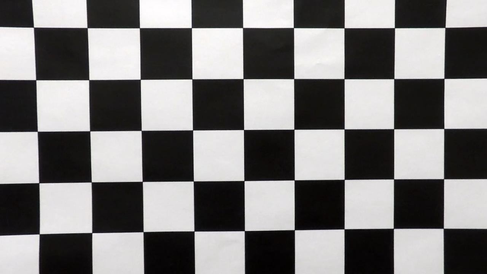
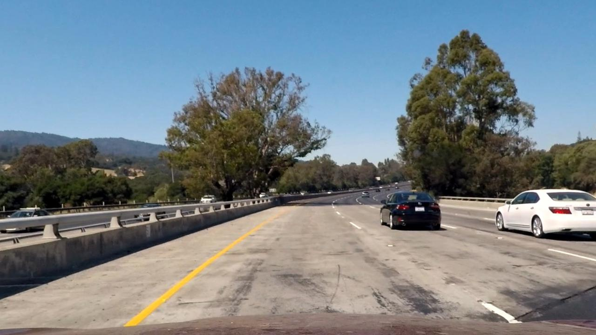
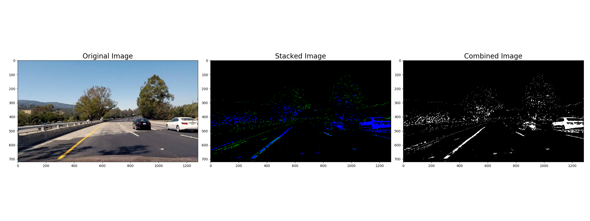
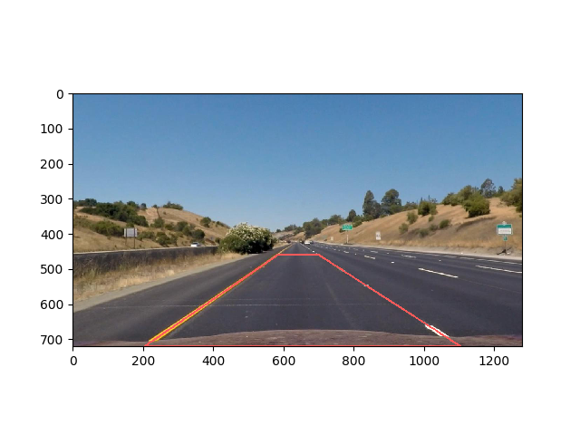
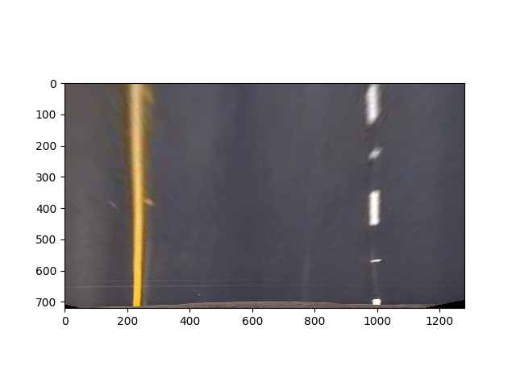
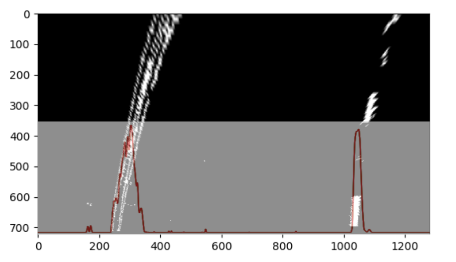
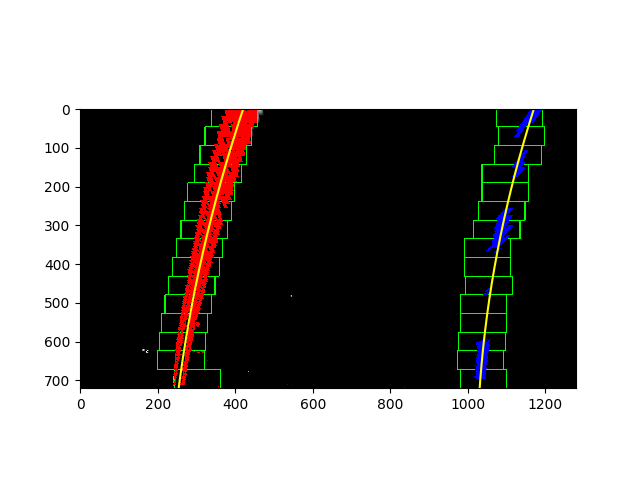
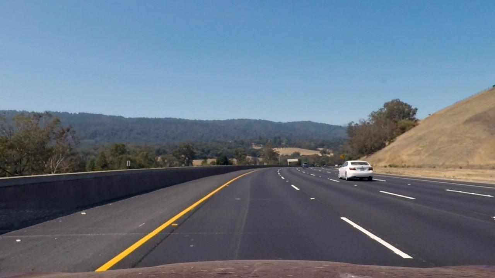
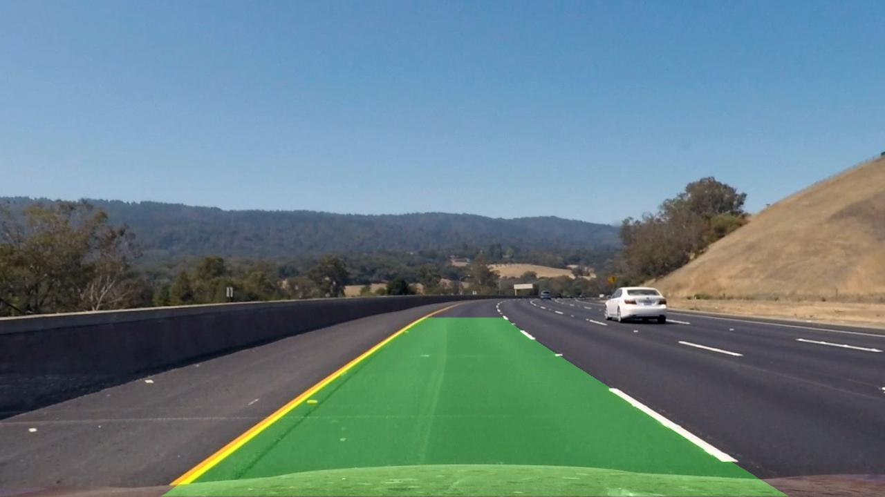

## Advanced Lane Finding

The code in the Jupyter Notebook file `advanced_lane_finding.ipynb` demonstrates a pipeline to detect lane lines on either a single road image or a video stream.

The pipeline is tested on the images inside the folder `test_images` and the video file `project_video.mp4`. 

Output result are stored inside the folders `output_images` and `output_videos`.

**The following steps are taken to detect the lane lines**

1. Camera Calibration
2. Apply distortion correction to actual images / video stream
3. Create a thresholded binary image 
4. Perspective transform the image into birds-eye view
5. Detect lane pixels on the perspective transformed and thresholded image
6. Determine lane curvature and vehicle offset in respect to lane center
7. Project the lane detection back onto the original image
8. Create a single image or video stream output with lane detection, lane curvature and vehicle offset drawn on it

### Camera Calibration & Distortion Correction

The camera has been calibrated in order to circumvent radial distortion.

20 images of the same cheesboard have been taken with the camera -> to be found in folder `camera_cal`. Each image fits the same amount (54) of object points (x,y,z), assuming z = 0, being that the chessboard image is mounted on a flat surface.

- 9 points horizontal
- 6 points vertical 
- Total -> 54 points

Each time corners are detected successfully (using OpenCV's function `findChessboardCorners`) the object points and corner coordinates are appended to seperate lists. By this we obtain two lists

- `objpoints` -> holds the number of the object point. E.g. (0, 0) for the top left point
- `imgpoints` -> holds the coordinates of the respective object point

With those points the distortion coefficients can be calculated by using OpenCV's function `calibrateCamera`.

Using the distortion coefficients we can now undistort any given image (taken by the same camera) using OpenCV's function `undistort`.

Code can be found inside  notebook cells #2 and #3

Original chessboard image             | Undistorted chessboard image 
:-------------------------:|:-------------------------:
  |  

|Undistorted road image             |
|:-------------------------:|
|  |

### Threshold Binary Image

A combination of color and gradient thresholding was used to generate a binary image. This images serves as base for the prespective transform and for identifying edges.

The following three thresholding techniques are combined:

- Computing the S and H color channel gradient after converting the image to HLS color space. The thresholds were (170, 255) for the S channel and (220, 255) for the H channel.
- Computing the gradient in X and Y direction for values between 50 and 100 (0 = black / 255 = white).
- Computing the directional gradient for angles between 0.7 and 1.7 radiants.

Code can be found inside function `compute_binaries()` in notebook cell #6.

The result is shown below from left to right:

- Original image
- Color gradient and directional gradient stacked on top of each other
- Thresholded, binary image

### Perspective Transform

In order to detect the lane line pixels, the binary image was transformed into a birds-eye view (view form above).

In order to determine the source and destination points for the perspective transform, an image with as much a straight road as possible was selected. 

The source points are manually selected by eyeballing four points covering the road lines.

The destination points are selected to form a rectangle with the aim of having the road lines appear parallel on the perspective transformed image

Code can be found inside function `warp()` in notebook cell #10

| Original image with source points                            | Perspective transformed image                                |
| ------------------------------------------------------------ | ------------------------------------------------------------ |
|  |  |

### Lane Pixel Detection

After obtaining the perspective transformed image, a histogram search at the bottom half of the image was performed. The two most prominent peaks very likely indicate the beginning of the left and right lane line as shown below.

Starting at the position of the histogram peaks, a sliding window techinque is applied to obtain all lane line pixels starting from the bottom of the image to the top of the image. A total of 15 windows was defined whereas each new window is placed on the mean position of the pixel values from the window before. This is if a minimum pixel count of 50 was detected in the previous window. After identifying all the pixels that belong to a lane line, a 2nd degree polynomial is fitted through the left line pixels and right line pixels. Code can be found inside functions `find_lane_pixels()` and `fit_polynomial()` in notebook cells 13 and 14.

After a line has been detected in the first frame of the video via histogram and sliding window search, the algorithm then searches the lane lines for the second to n frame around the left lane and right lane polynomial from the previous frame. For this the polynomial coefficients of the last frame are tracked. 

Code can be found in function `search_around_poly()` in notebook cell 20.

### Lane Curvature and Vehicle Offset

Given the lane line equation

and the equation for curvature radius 

the lane line radius can be calculated with the  formula

Before calculation, the polynomial values are first converted from pixel space to meters with the following ratios

**y direction** -> 20m / 720px, that is assuming 20m equals the image height of 720px

**x direction** -> 3.7m / 770px, that is assuming the lane line width in real world averages 3.7 meters and the lane line width in the perspective transformed image is approx. 770 px wide.

The lane curvature is calculated at the y-axis center of the image (y = 360px)

The vehicle offset (deviation of the vehicle from the lane center) is calculated assuming the camera is mounted at the center of the vehicle.

Then the vhicle offset is the lane center minus the image center

`offset = lane_center - image_center`

Also here all values are converted from pixel space to meters first using the same ratios as for the lane curvature calculation.

Code can be found inside functions `measure_curvature_real()` and `measure_offset()` in notebook cells 17 and 18.

### Draw projection on the image

Finally the lane line projection is drawn back onto the original image by creating a colored polygon  that fills the lane detected area.

Code can be found in the notebook cell 16

  
   

### Video stream

The pipeline for processing a video stream can be found in notebook cell 24 and basically uses the steps described as above.

Additionally it should be noted that for the video, the lane lines are averaged over the most recent seven findings. This can be changed with the parameter `smoothing`

The following things are tracked across every frame of the video

- Count of the current frame

- Polynomial coefficients of the current frame

  

For that reason a class `Line()` is defined that holds the objects for every frame.

Class definition can be found in the file **tracking.py**. 

Class instances and objects are initiated in notebook cells 22 and 23.

**Raw input video** ---> `project_video.mp4` 

**Processed video** --> `/output_videos/project_video.mp4`

**Disclaimer**

- The pipeline is not suited for real-time applications and currently runs at approx. 5-6 frames / second.
- The pipeline assumes a good lane detection on the first frame. Starting with the second frame the algorithm starts searching for lane lines based on the lane line detection from the previous frame. Another possibility would have been to decide on the lane searching method based on the quality of the lane detection of the current frame. However I found the first method to work more reliable.
- Also this pipeline is likely to fail on sharp turns (lane lines cutting to the right-hand or left-hand edge of the screen)

Generally the perspective transform approach is often very specific to the camera and the mounting of it. Also, the color and gradient threshold often only work in a small set of conditions. 

**Improvement Ideas**

- A deep learning approach could be used to identify the lane lines (briefly described in this article [Lane Detection with Deep Learning]( https://towardsdatascience.com/lane-detection-with-deep-learning-part-1-9e096f3320b7 ) )
- Terminate the lane pixel search if the search window touches one of the image edges.
- Implement techniques to determine the quality of the lane detection in the current frame. If the detection in the current frame is not good enough, the search in the next frame is based on this  result. This eventually adds up to bad overall results or lane lines not being detected at all anymore. As an example check the algorithm applied to video `challenge_video.mp4`. 
